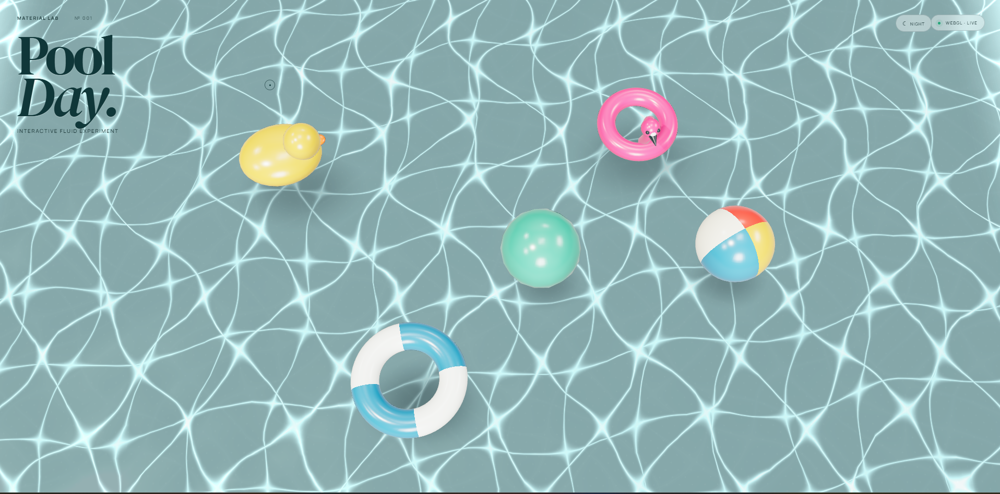
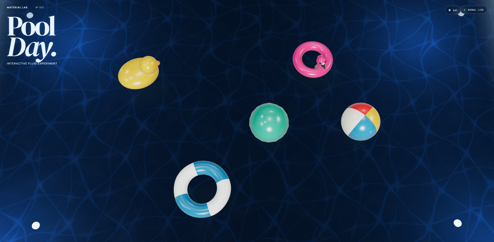

# Material Lab — Pool Day

**Pool Day** es una experiencia WebGL interactiva desarrollada con **Three.js** y **Vite**, centrada en experimentar con materiales, iluminación, movimiento y simulación visual de agua en tiempo real.

La escena representa una piscina interactiva con objetos flotantes, reflejos dinámicos, caústicas y ondas que reaccionan a la interacción del usuario.

## Vista previa

### Modo día



### Modo noche



## ✨ Características

- Renderizado 3D en tiempo real con **Three.js**
- Agua interactiva con movimiento dinámico
- Simulación visual de **caústicas**
- Ondas generadas mediante interacción con el agua
- Objetos flotantes con movimiento orgánico
- Sistema de iluminación dinámico
- Materiales PBR y superficies reflectantes
- Interacción mediante **raycasting**
- Parallax controlado por el movimiento del puntero
- Objetos arrastrables dentro de la escena
- Modo visual **Day / Night**
- Interfaz minimalista superpuesta sobre WebGL
- Diseño responsive para diferentes tamaños de pantalla

## 🎮 Interacción

La escena responde directamente a las acciones del usuario:

- **Mover el cursor** → genera un efecto de parallax sutil.
- **Hacer clic sobre el agua** → crea ondas en la superficie.
- **Arrastrar objetos** → permite desplazarlos por la piscina.
- **Hacer clic sobre un objeto** → permite inspeccionar la muestra/material.
- **Day / Night** → modifica la iluminación y la atmósfera de toda la escena.

La iluminación, los materiales y diferentes parámetros de la simulación se actualizan en tiempo real mediante `uniforms` y propiedades de la escena.

## 🛠️ Tecnologías

- **JavaScript**
- **Three.js**
- **WebGL**
- **GLSL / Shaders**
- **Vite**
- **HTML5**
- **CSS3**

## 🌊 Renderizado

La experiencia combina diferentes técnicas de gráficos en tiempo real:

```text
WebGL
 ├── Three.js Scene
 │   ├── Camera
 │   ├── Lighting
 │   ├── Pool Geometry
 │   ├── Water Material
 │   └── Floating Objects
 │
 ├── Shaders / Uniforms
 │   ├── Water deformation
 │   ├── Caustics
 │   ├── Light response
 │   └── Time-based animation
 │
 └── Interaction
     ├── Pointer movement
     ├── Raycasting
     ├── Dragging
     └── Water disturbances
